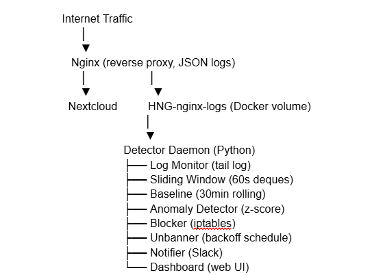
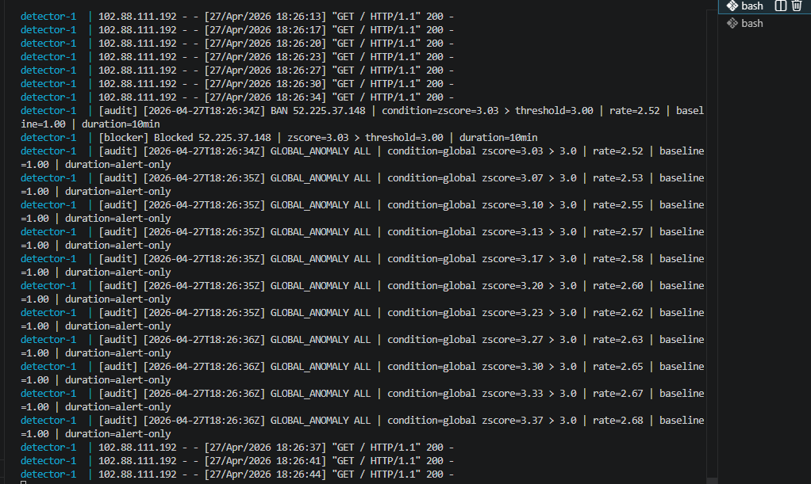
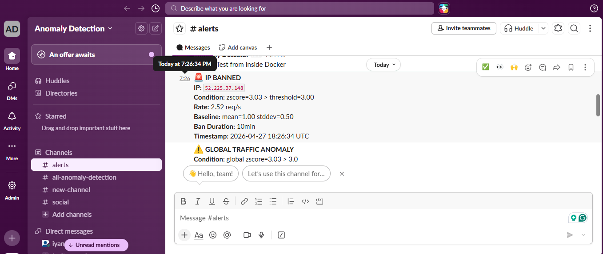
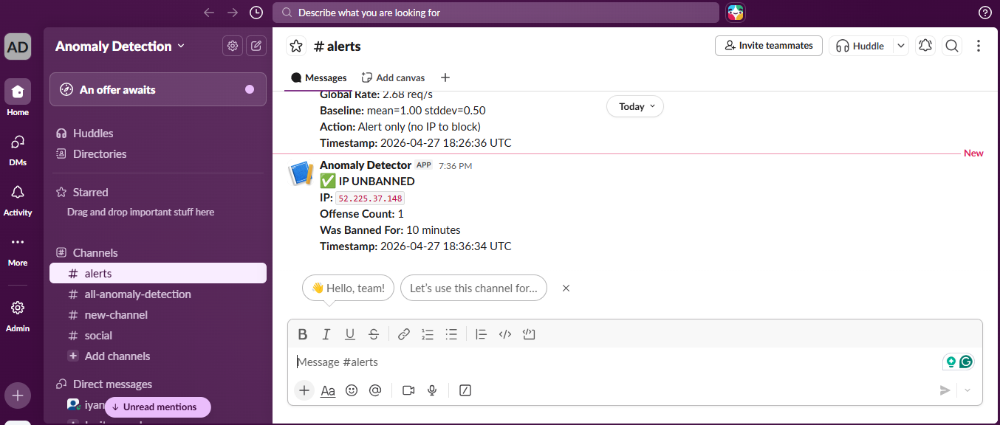
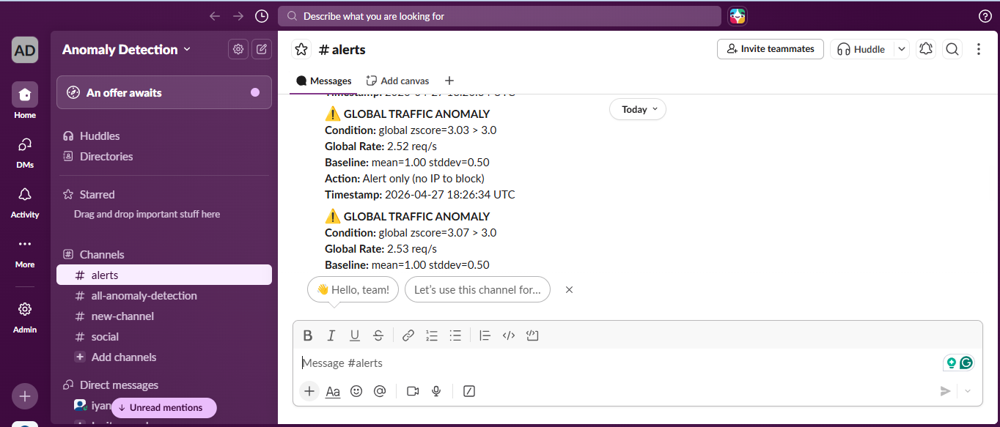
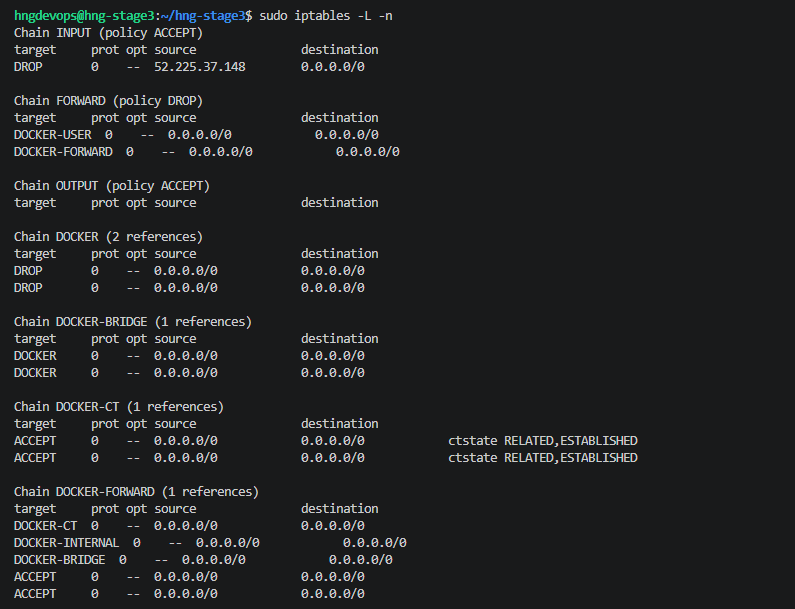
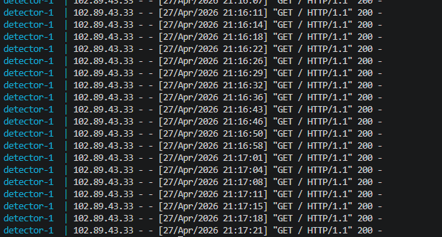
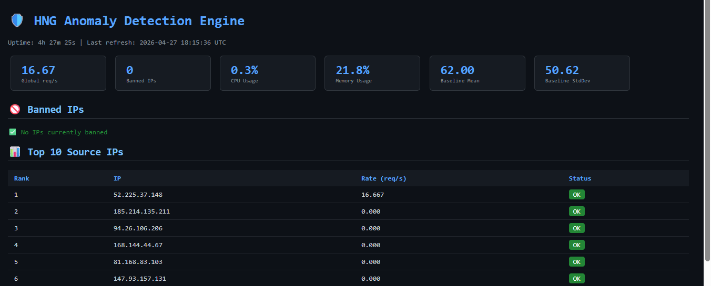

# 🛡️ HNG Stage 3 — Real-Time Anomaly Detection & DDoS Mitigation Engine

A production-grade DevSecOps security daemon that watches all incoming HTTP traffic in real time, learns what normal looks like, and automatically blocks threats using kernel-level `iptables` rules — built entirely from scratch without Fail2Ban or any rate-limiting library.

---

## 🔗 Live Project Links

| Resource | URL |
|---|---|
| **Metrics Dashboard** | http://monitor.oluwahiyanu.mooo.com:8080 |
| **Server IP** | `52.225.37.148` |
| **GitHub Repo** | https://github.com/oluwahiyanu/hng-stage3 |
| **Blog Post** | https://medium.com/@iyanurtm/how-i-built-a-real-time-anomaly-detection-engine-from-scratch-1785b5525bb1 |

---

## 🏗️ System Architecture

The system uses a **sidecar pattern** — a Python daemon runs alongside Nextcloud, sharing logs through a named Docker volume. It never touches the application; it only watches, learns, and enforces.

```text
Internet Traffic
      │
      ▼
   Nginx (reverse proxy, JSON logs)
      │                    │
      ▼                    ▼
  Nextcloud          HNG-nginx-logs (Docker volume)
                           │
                           ▼
                    Detector Daemon (Python)
                    ├── Log Monitor   (tail log line by line)
                    ├── Sliding Window (60s deques per IP + global)
                    ├── Baseline      (30min rolling mean/stddev)
                    ├── Anomaly Detector (z-score + rate multiplier)
                    ├── Blocker       (iptables DROP rules)
                    ├── Unbanner      (backoff: 10min → 30min → 2hr → permanent)
                    ├── Notifier      (Slack webhook alerts)
                    └── Dashboard     (Flask web UI, refreshes every 3s)
```



---

## 📁 Repository Structure

```
hng-stage3/
├── detector/
│   ├── main.py          # Entry point — wires all components together
│   ├── monitor.py       # Tails and parses Nginx JSON log line by line
│   ├── baseline.py      # Rolling 30-min mean/stddev with per-hour slots
│   ├── detector.py      # Z-score and rate multiplier anomaly logic
│   ├── blocker.py       # iptables DROP rule management
│   ├── unbanner.py      # Backoff auto-unban background thread
│   ├── notifier.py      # Slack webhook alerts
│   ├── dashboard.py     # Flask web dashboard (port 5000)
│   ├── audit.py         # Structured audit log writer
│   ├── config.yaml      # All thresholds and settings — nothing hardcoded
│   └── requirements.txt
├── nginx/
│   └── nginx.conf       # Reverse proxy + JSON access log config
├── docs/
│   └── architecture.png
├── screenshots/
│   ├── Tool-running.png
│   ├── Ban-slack.png
│   ├── Unban-slack.png
│   ├── Global-alert-slack.png
│   ├── Iptables-banned.png
│   ├── Audit-log.png
│   └── Baseline-graph.png
├── docker-compose.yml
└── README.md
```

---

## 🧠 Why Python?

Python was chosen for three reasons:

1. **Rich standard library** — `collections.deque`, `statistics`, `subprocess`, and `threading` are all built in. No external libraries needed for the core detection logic.
2. **Readable math** — The z-score formula `(rate - mean) / stddev` reads exactly like the formula on paper, making it easy to audit and verify.
3. **Concurrency without complexity** — The `threading` module handles concurrent baseline recalculation, log tailing, and the unban scheduler cleanly without complex async frameworks.

---

## 🔬 How the Sliding Window Works

The sliding window is the **real-time memory** of the system. It answers: _"How many requests has this IP sent in the last 60 seconds right now?"_

### The Data Structure

Each IP gets its own `deque` (double-ended queue). A deque is a list where you can efficiently add to one end and remove from the other — perfect for a time-based window.

```python
from collections import deque
timestamps = deque()  # stores arrival time of each request
```

### Eviction Logic

Every time a new request arrives, two things happen simultaneously:

1. **Add** — the current timestamp is appended to the right end
2. **Evict** — all timestamps older than 60 seconds are popped from the left end

```python
def add(self, timestamp: float):
    self.timestamps.append(timestamp)        # add new request to right
    cutoff = timestamp - self.window_seconds # 60 seconds ago
    while self.timestamps and self.timestamps[0] < cutoff:
        self.timestamps.popleft()            # evict old requests from left
```

### Why Not a Simple Counter?

A per-minute counter resets at the top of every minute. A spike at 1:59 and another at 2:01 appear as two small events in different buckets even though they happened 2 seconds apart.

The sliding window sees them together in the same 60-second window — correctly reflecting the attacker's true rate.

### Rate Calculation

```python
def rate(self) -> float:
    return len(self.timestamps) / self.window_seconds
```

If 180 timestamps are in the deque: `180 / 60 = 3.0 req/s`.

---

## 📊 How the Baseline Works

The baseline is the **long-term memory** of the system. It answers: _"What does normal traffic look like on this server?"_

### Window Size

A **30-minute rolling window** of per-second request counts. Every second, the count of requests in that second is recorded. After 30 minutes that is 1,800 data points — enough for a reliable mean and standard deviation.

### Recalculation Interval

Baseline recalculates every **60 seconds**. This is a deliberate trade-off — too frequent wastes CPU, too infrequent means slow adaptation to traffic pattern changes.

### Per-Hour Slots

The baseline maintains separate data for each hour of the day (0–23). When the current hour has enough data points, the engine **prefers the current hour's data** over the full 30-minute window. This handles natural traffic variation between peak hours (9am) and off-peak hours (3am).

```python
current_hour = datetime.now().hour
hour_data    = self.hourly_slots.get(current_hour, [])

if len(hour_data) >= self.min_samples:
    counts = hour_data                         # prefer current hour
else:
    counts = [c for _, c in self.per_second_counts]  # fall back to 30min
```

### Floor Values

To prevent false positives during near-zero traffic, floor values are enforced:

```yaml
baseline_floor_mean:   1.0   # prevents division-by-zero issues
baseline_floor_stddev: 0.5   # prevents hair-trigger sensitivity at low traffic
```

---

## 🚨 Anomaly Detection Logic

Detection fires when **either** condition is true — whichever triggers first:

### Condition 1 — Z-Score

```
Z = (current_rate - baseline_mean) / baseline_stddev
```

If `Z > 3.0` the rate is more than 3 standard deviations above normal. In a normal distribution this has a 0.3% chance of occurring naturally — it almost certainly means an attack.

### Condition 2 — Rate Multiplier

If `current_rate > 5 × baseline_mean` — regardless of standard deviation, if an IP is sending 5x the average rate it is flagged immediately.

### Error Surge (Threshold Tightening)

If an IP's 4xx/5xx error rate exceeds 3x the baseline error rate, its z-score threshold is tightened by 50% (3.0 → 1.5). This catches scanning and credential stuffing attacks that generate bursts of 401/404 errors before ramping up to full speed.

---

## 🔥 How iptables Blocking Works

When an IP is flagged the daemon adds a kernel-level DROP rule:

```python
subprocess.run(
    ["iptables", "-I", "INPUT", "-s", ip, "-j", "DROP"],
    check=True
)
```

This tells the Linux kernel to silently discard all packets from that IP at the network layer — before they ever reach Nginx, Nextcloud, or any application code.

### Auto-Unban Backoff Schedule

| Offense | Ban Duration |
|---|---|
| 1st | 10 minutes |
| 2nd | 30 minutes |
| 3rd | 2 hours |
| 4th+ | Permanent |

Each unban sends a Slack notification and writes a structured entry to the audit log.

---

## 📋 Audit Log

Every action is written to `/var/log/detector/audit.log`:

```
[2026-04-27T18:26:31Z] BAN 52.225.37.148 | condition=zscore=3.03 > threshold=3.0 | rate=184.23 | baseline=62.00 | duration=10min
[2026-04-27T18:36:31Z] UNBAN 52.225.37.148 | condition=zscore=3.03 > threshold=3.0 | rate=184.23 | baseline=0.00 | duration=after 10min
[2026-04-27T18:37:00Z] GLOBAL_ANOMALY ALL | condition=global zscore=4.12 > 3.0 | rate=312.00 | baseline=62.00 | duration=alert-only
```

---

## 📸 Required Screenshots

| Screenshot | Description |
|---|---|
|  | Daemon processing live log lines |
|  | Slack ban notification with rate and baseline |
|  | Automatic unban after backoff period |
|  | Global traffic anomaly Slack alert |
|  | Active DROP rule in iptables |
|  | Structured audit entries |
|  | Baseline mean shifting across hourly slots |

---

## 🚀 Setup Instructions (Fresh VPS to Running Stack)

### Prerequisites

- Ubuntu 22.04 LTS
- Minimum 2 vCPU, 2 GB RAM
- Ports 22, 80, 443, and 8080 open in firewall/NSG

### Step 1 — Install Docker

```bash
sudo apt update && sudo apt upgrade -y
sudo apt install -y ca-certificates curl gnupg
sudo install -m 0755 -d /etc/apt/keyrings
curl -fsSL https://download.docker.com/linux/ubuntu/gpg | \
  sudo gpg --dearmor -o /etc/apt/keyrings/docker.gpg
echo "deb [arch=$(dpkg --print-architecture) signed-by=/etc/apt/keyrings/docker.gpg] \
  https://download.docker.com/linux/ubuntu $(. /etc/os-release && echo $VERSION_CODENAME) stable" | \
  sudo tee /etc/apt/sources.list.d/docker.list
sudo apt update && sudo apt install -y docker-ce docker-ce-cli containerd.io docker-compose-plugin
sudo usermod -aG docker $USER && newgrp docker
```

### Step 2 — Clone the Repository

```bash
git clone https://github.com/oluwahiyanu/hng-stage3.git
cd hng-stage3
```

### Step 3 — Configure Slack Webhook

```bash
nano detector/config.yaml
# Set: slack_webhook_url: "https://hooks.slack.com/services/YOUR/WEBHOOK/URL"
```

### Step 4 — Start the Stack

```bash
docker compose up -d --build
```

### Step 5 — Verify Everything is Running

```bash
# All three containers should be up
docker compose ps

# Watch the detector processing logs
docker compose logs -f detector

# Confirm JSON logs are being written
tail -f /var/log/nginx/hng-access.log

# Confirm dashboard is accessible
curl -si http://localhost:8080/

# Confirm iptables access works
sudo iptables -L -n
```

### What a Successful Startup Looks Like

```
NAME                     STATUS
hng-stage3-nextcloud-1   Up
hng-stage3-nginx-1       Up
hng-stage3-detector-1    Up

[main] HNG Anomaly Detection Engine starting...
[unbanner] Started background unban checker
[dashboard] Running on port 5000
[monitor] Tailing log: /var/log/nginx/hng-access.log
[baseline] Recalculated from 30min-window: mean=1.00 stddev=0.50
```

### Step 6 — Test Detection

```bash
# Simulate an attack to trigger detection
for i in {1..400}; do curl -s http://YOUR_SERVER_IP/ > /dev/null & done

# Verify the block was applied (should show DROP rule)
sudo iptables -L -n | grep DROP

# View the audit log
cat /var/log/detector/audit.log
```

---

## ⚙️ Configuration Reference

All thresholds are in `detector/config.yaml` — nothing is hardcoded in the source:

| Setting | Default | Description |
|---|---|---|
| `sliding_window_seconds` | 60 | Duration of per-IP and global sliding windows |
| `baseline_window_minutes` | 30 | How far back the rolling baseline looks |
| `baseline_recalc_interval` | 60 | Recalculation interval in seconds |
| `zscore_threshold` | 3.0 | Z-score above which an IP is flagged |
| `rate_multiplier_threshold` | 5.0 | Rate multiple above baseline that triggers detection |
| `error_rate_multiplier` | 3.0 | Error rate multiple that tightens detection threshold |
| `baseline_floor_mean` | 1.0 | Minimum effective mean |
| `baseline_floor_stddev` | 0.5 | Minimum effective standard deviation |
| `ban_schedule_minutes` | [10, 30, 120] | Backoff durations per offense |
| `dashboard_port` | 5000 | Flask dashboard port |

---

## ✅ Requirements Compliance

| Requirement | Status |
|---|---|
| Linux VPS min 2 vCPU / 2 GB RAM | ✅ Azure Standard_B2s |
| Nextcloud via Docker Compose | ✅ kefaslungu/hng-nextcloud |
| Nginx reverse proxy with JSON logs | ✅ hng-access.log |
| Named volume `HNG-nginx-logs` | ✅ All services mount it |
| X-Forwarded-For real IP forwarding | ✅ nginx.conf |
| JSON log fields (source_ip, timestamp, method, path, status, response_size) | ✅ Verified |
| Continuous Python daemon (not cron) | ✅ restart: unless-stopped |
| Deque-based sliding window (no libraries) | ✅ collections.deque only |
| Rolling 30-min baseline with per-hour slots | ✅ baseline.py |
| Z-score > 3.0 AND rate > 5x mean | ✅ detector.py |
| Error surge threshold tightening | ✅ detector.py |
| iptables DROP within 10 seconds of detection | ✅ blocker.py |
| Slack alert on ban with all required fields | ✅ notifier.py |
| Auto-unban backoff: 10min → 30min → 2hr → permanent | ✅ unbanner.py |
| Global anomaly Slack alert (no ban) | ✅ detector.py + notifier.py |
| Dashboard: banned IPs, req/s, top 10, CPU/mem, baseline, uptime | ✅ dashboard.py |
| Dashboard on domain | ✅ monitor.oluwahiyanu.mooo.com:8080 |
| Structured audit log | ✅ audit.py |
| No Fail2Ban | ✅ Pure Python + iptables subprocess |
| No rate-limiting libraries | ✅ collections.deque only |
| Baseline not hardcoded | ✅ Computed from live traffic |

---

## 🔒 Whitelisted IPs

These IPs belong to the HNG grading infrastructure and will never be blocked:

| IP | Hostname |
|---|---|
| `104.21.72.161` | kefaslungu.name.ng (Cloudflare) |
| `172.67.153.35` | kefaslungu.name.ng (Cloudflare) |
| `20.121.201.73` | ws.kefaslungu.name.ng (WebSocket grader) |

---

## 🏷️ Tech Stack

| Layer | Technology |
|---|---|
| Application | Nextcloud 28.0.14 (PHP 8.2 / Apache) |
| Reverse Proxy | Nginx Alpine |
| Detection Engine | Python 3.11 |
| Containerisation | Docker + Docker Compose v2 |
| Firewall | Linux iptables via subprocess |
| Alerting | Slack Incoming Webhooks |
| Dashboard | Flask 3.0 + psutil |
